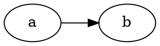

# Rendering dot in mdBook

The **mdBook** [theme](https://rust-lang.github.io/mdBook/format/theme/index.html) allows the addition of custom elements to the top of the rendered HTML pages using a file named `theme/head.hbs`. This is a useful feature for adding specific metadata or scripts that need to be included in the `<head>` section of each page. Referencing [this](https://oko.io/howto/graphviz-in-markdown/) blog post on rendering dot in markdown file, there are four scripts required. The first three need to be added to `head.hbs`

```html
<script src="https://unpkg.com/d3@5.16.0/dist/d3.min.js"></script>
<script src="https://unpkg.com/@hpcc-js/wasm@0.3.11/dist/index.min.js"></script>
<script src="https://unpkg.com/d3-graphviz@3.1.0/build/d3-graphviz.min.js"></script>
```

and copy a function into a file `script.js`[^1]

```js
function d3ize(elem) {
    var par = elem.parentElement;
    d3.select(par).append('div').graphviz().renderDot(elem.innerText);
    d3.select(elem).style('display', 'none');
}

console.log(document.getElementsByClassName(".language-dot"));
var dotelems = document.getElementsByClassName("language-dot");
for (let elem of dotelems) {
    d3ize(elem);
}
```

in the `book.toml` file add these lines[^2].

```toml
[output.html]
copy-fonts = true
additional-js = ["script.js"]
```


and your graph should appear.



[^1]: I would have thought I could have included the script itself in the `head.hbs` file, however, when I attempted it the graph did not render. Which is unfortunate, as it would then require only a single modification.

[^2]: I also tried adding the remote scripts to the `additional-js` property, but `mdBook build` complained of not being able to find the files. 
